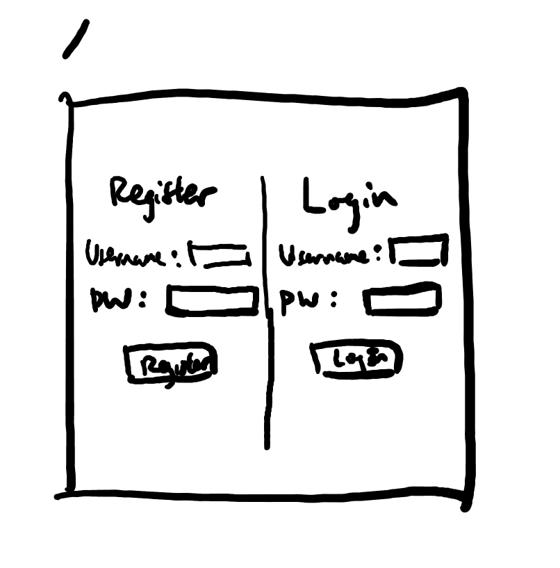
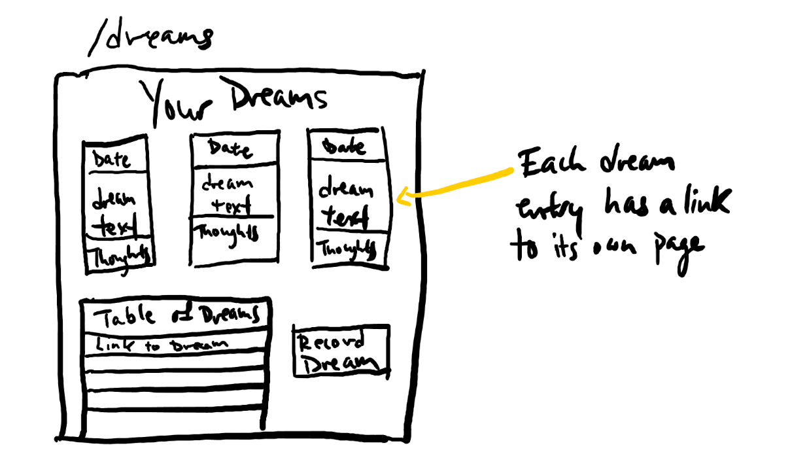
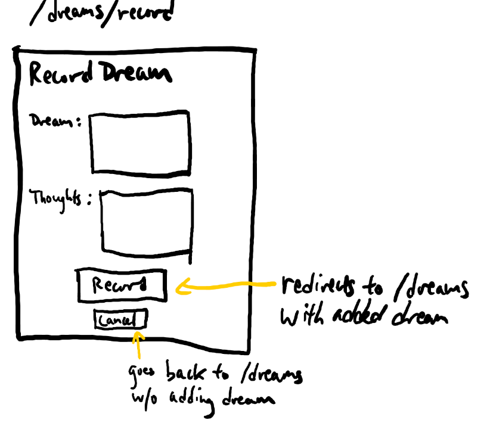
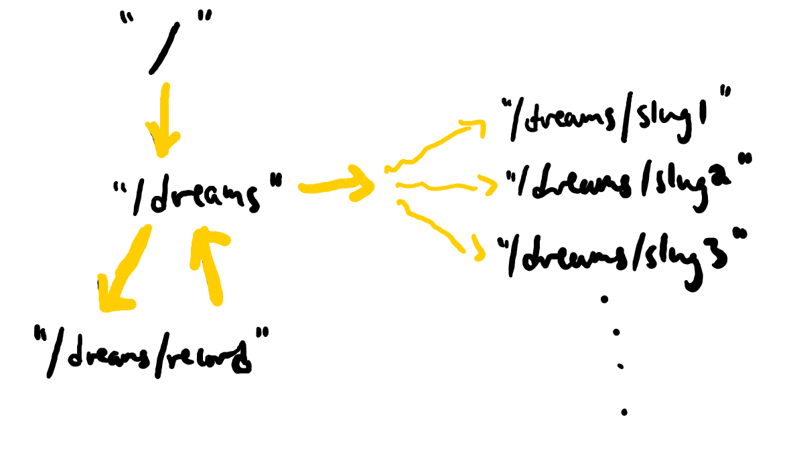

# Dream Diary

## Overview

Dream Diary is a web app that allows users to record memories of their dreams all into one place. After a user registers for an account and logs in, they can create dream entries. Each dream entry will include the date, the actual memory of the dream itself in text, and any associations or thoughts the user has with that dream.

Once dream entries have been added, the home page (assuming the user is logged in) will prominently display the most recent (number of entries pending) dream entries.


## Data Model
The application will store Users and Dreams

An Example User:

```javascript
{
  username: "dreamydavid",
  hash: // a password hash
}
```

An Example Dream:

```javascript
{
  user: // a reference to a User object
  date: //A JavaScript Date object
  title: "A Strange Adventure"
  dream: "I was being chased by a bear because I was covered in honey. But then I ran into a tree that teleported me high up in the sky. Instead of plummeting to Earth, I floated slowly down, catching parts of clouds to eat as cotton candy. When I finally touched the ground I woke up.", //a string that represents the dream
  thoughts: "maybe the bear chasing me is a sign of my anxiety", //not required on initial entry, can be added later
}
```

## Wireframes
/ - registration and login page



/dreams - displays most recent dream entries at top, table of dream entries, and button to record a dream entry



/dreams/record - page for recording the details of a dream



/dreams/slug - page for showing specific dream


## Site map



## User Stories or Use Cases

1. as non-registered user, I can register a new account with the site
2. as a user, I can log in to the site
3. as a user, I can record a new dream
4. as a user, I can view all my recorded dreams in one page
5. as a user, I can view any specific dream in its own page
6. as a user, I can edit anything about a specific dream


## [Link to Initial Main Project File](app.js) 

## Annotations / References Used

1. [heroku](https://devcenter.heroku.com/articles/preparing-a-codebase-for-heroku-deployment) 
    * [mongodb atlas integration](https://developer.mongodb.com/how-to/use-atlas-on-heroku)

2. [passport.js authentication docs](http://passportjs.org/docs) 
    * source code based on passport:
      - [configuration, includes using mongodb as session store for passport](https://github.com/nyu-csci-ua-0480-034-fall-2020/austintian03-final-project/blob/45e2a029c2923717463a532e45c732633ec263ad/app.js#L4-L51)
      - [implementation of login/registration/logout with passport](https://github.com/nyu-csci-ua-0480-034-fall-2020/austintian03-final-project/blob/45e2a029c2923717463a532e45c732633ec263ad/app.js#L198-L242)
      - [integration with mongoose](https://github.com/nyu-csci-ua-0480-034-fall-2020/austintian03-final-project/blob/45e2a029c2923717463a532e45c732633ec263ad/db.js#L3-L15)

3. [bootstrap docs](https://getbootstrap.com/docs/4.5/getting-started/introduction/) - (add link to bootstrap configuration)
